# Mini Uniswap V2 系统架构流程图

## 完整系统架构流程图 (Mermaid)

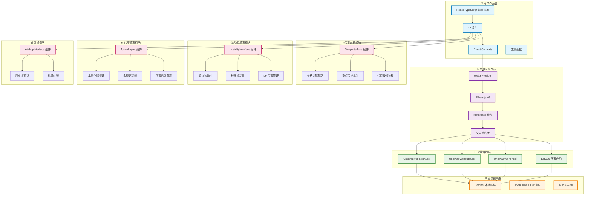

## 代币交换流程图

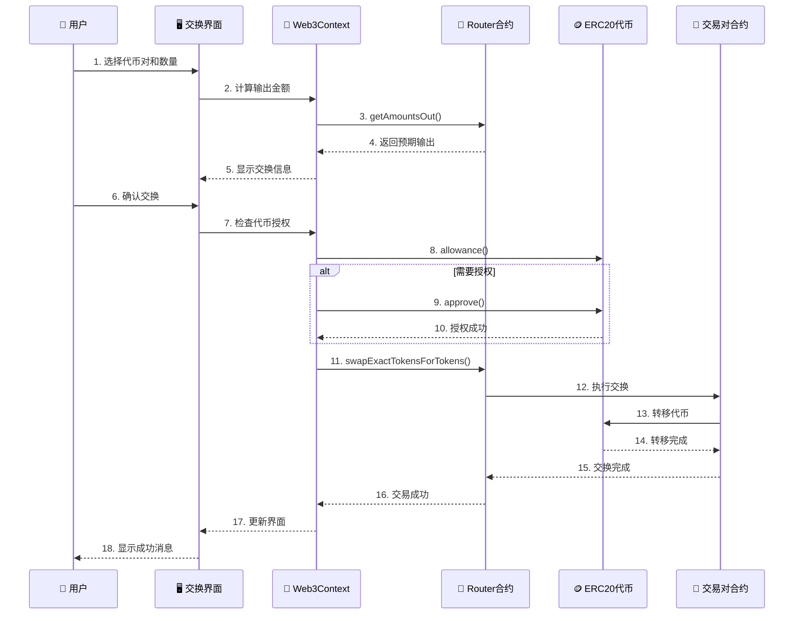

## 流动性管理流程图

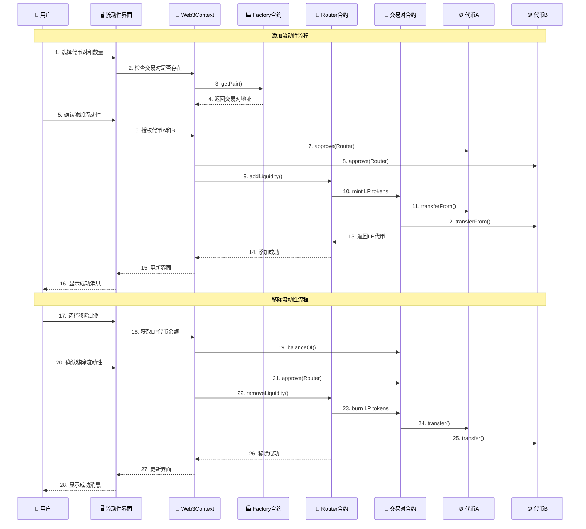

## 代币导入和管理流程图

```mermaid
flowchart TD
    Start([开始导入代币]) --> Input[输入代币地址]
    Input --> Validate{验证地址有效性}

    Validate -->|无效| Error1[显示错误信息]
    Validate -->|有效| GetInfo[获取代币信息]

    GetInfo --> Contract[调用合约方法]
    Contract --> Name[name()]
    Contract --> Symbol[symbol()]
    Contract --> Decimals[decimals()]
    Contract --> Balance[balanceOf()]

    Name --> Combine[合并代币信息]
    Symbol --> Combine
    Decimals --> Combine
    Balance --> Combine

    Combine --> Save[保存到本地存储]
    Save --> Update[更新UI显示]
    Update --> Success[导入成功]

    Contract -->|调用失败| Error2[显示错误信息]
    Error1 --> End([结束])
    Error2 --> End
    Success --> End

    %% 本地存储管理
    subgraph Storage[本地存储管理]
        LocalStorage[(localStorage)]
        Export[导出数据]
        Import[导入数据]
        Clear[清空数据]
    end

    Save --> LocalStorage
    LocalStorage --> Export
    LocalStorage --> Import
    LocalStorage --> Clear

    %% 余额更新
    subgraph BalanceUpdate[余额更新机制]
        Timer[30秒定时器]
        Manual[手动刷新]
        Auto[自动更新]
    end

    Success --> Timer
    Timer --> Auto
    Manual --> Auto
    Auto --> Contract
```

## 技术栈架构图

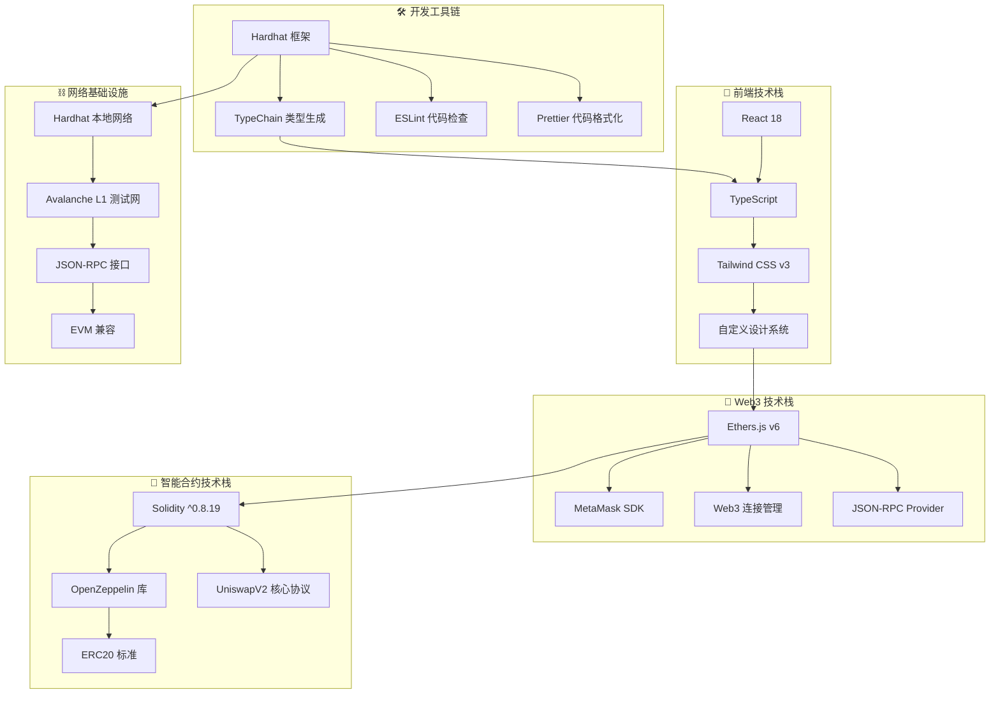

## 数据流向图

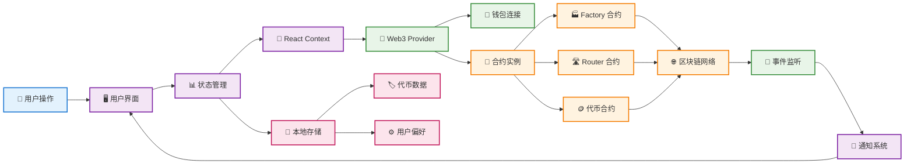

## 安全架构图

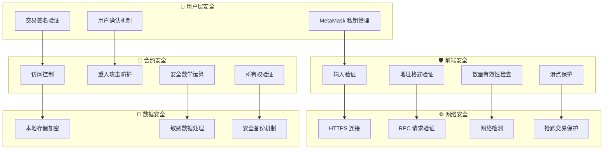

# 空投功能修复说明

## 问题描述

之前版本的空投功能存在设计问题：

- `airdropSingle` 和 `airdrop` 函数使用 `_mint()` 铸造新代币
- 这导致空投时不会从发送者余额中扣除代币
- 而是凭空创造新代币，增加总供应量

## 修复方案

将所有代币合约的空投函数改为使用 `_transfer()`：

```solidity
// 修复前（错误）
function airdropSingle(address recipient, uint256 amount) public onlyOwner {
    _mint(recipient, amount);  // 凭空创造代币
}

// 修复后（正确）
function airdropSingle(address recipient, uint256 amount) public onlyOwner {
    _transfer(msg.sender, recipient, amount);  // 从发送者转账
}
```

## 修复效果

- ✅ 空投后发送者余额正确减少
- ✅ 总供应量保持不变
- ✅ 符合正常的代币转账逻辑
- ✅ 确保空投发送者有足够余额

## 影响的合约

- USDT.sol
- ETH.sol
- AVALANCHE.sol
- SOLANA.sol

## 修复后的空投流程图

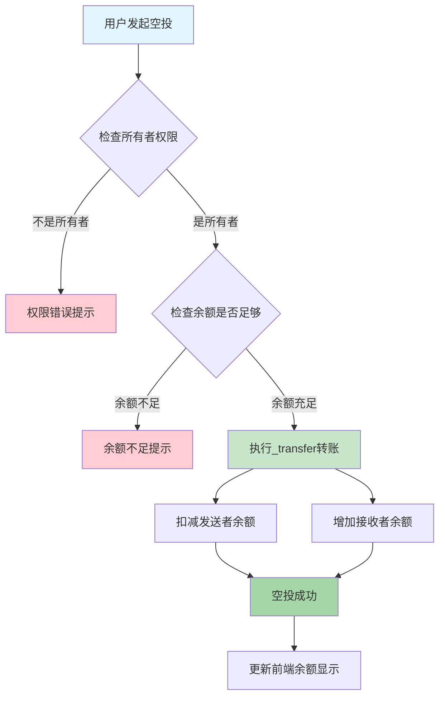

## 空投前后余额变化对比

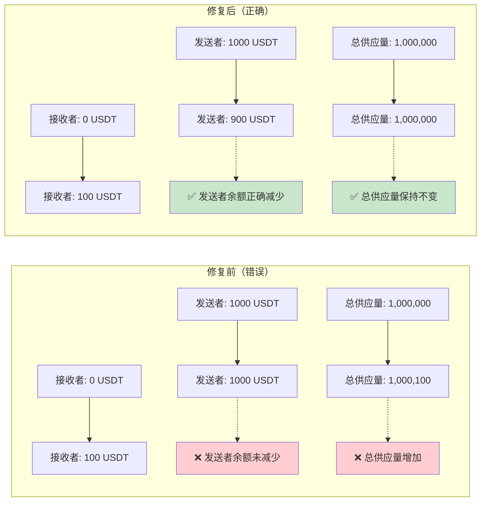

## 前端余额刷新机制流程图

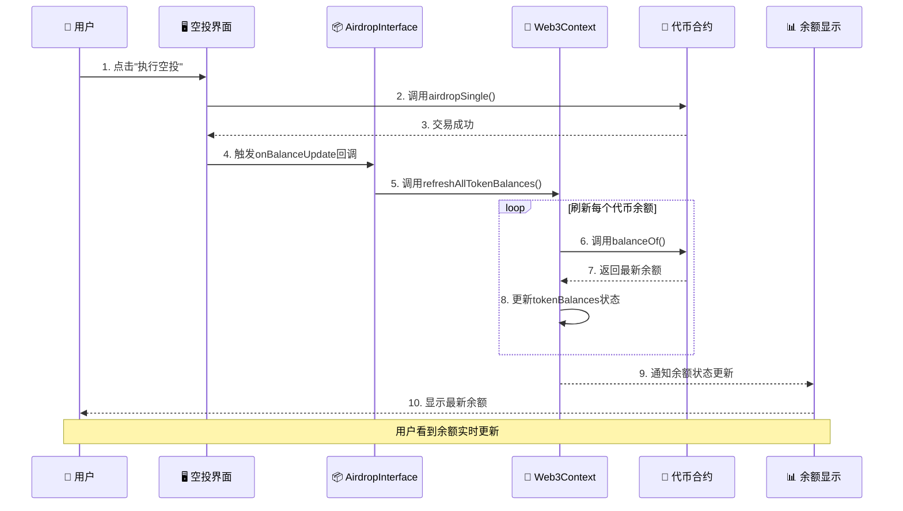

## 余额更新机制对比

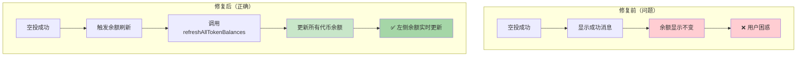

# 交换和流动性操作余额刷新修复说明

## 问题描述

在之前的版本中，只有空投功能具备余额刷新机制：

- 交换代币成功后，左侧余额显示不会更新
- 添加/移除流动性成功后，左侧余额显示不会更新
- 用户需要手动刷新页面才能看到最新余额

## 修复方案

为 SwapInterface 和 LiquidityInterface 组件添加与 AirdropInterface 相同的余额刷新机制：

### 1. 接口扩展

```typescript
// SwapInterface.tsx
interface SwapInterfaceProps {
  importedTokens: TokenInfo[];
  onBalanceUpdate?: () => void; // 新增回调
}

// LiquidityInterface.tsx
interface LiquidityInterfaceProps {
  importedTokens: TokenInfo[];
  onBalanceUpdate?: () => void; // 新增回调
}
```

### 2. 成功回调调用

```typescript
// SwapInterface - 交换成功后
await swapTx.wait();
addNotification({
  type: "success",
  title: "交换成功",
  message: "代币交换成功！",
});

// 刷新余额
if (onBalanceUpdate) {
  onBalanceUpdate();
}

// LiquidityInterface - 添加流动性成功后
await tx.wait();
addNotification({
  type: "success",
  title: "添加成功",
  message: "流动性添加成功！",
});

// 刷新余额
if (onBalanceUpdate) {
  onBalanceUpdate();
}
```

### 3. App.tsx 集成

```typescript
// 传递余额刷新回调给所有操作组件
{
  activeTab === "swap" && (
    <SwapInterface
      importedTokens={importedTokens}
      onBalanceUpdate={handleBalanceUpdate} // 新增
    />
  );
}
{
  activeTab === "liquidity" && (
    <LiquidityInterface
      importedTokens={importedTokens}
      onBalanceUpdate={handleBalanceUpdate} // 新增
    />
  );
}
```

## 修复效果

- ✅ 代币交换成功后左侧余额自动刷新
- ✅ 添加流动性成功后左侧余额自动刷新
- ✅ 移除流动性成功后左侧余额自动刷新
- ✅ 统一的余额刷新机制，用户体验一致
- ✅ 无需手动刷新页面即可看到最新余额

## 统一余额刷新流程图

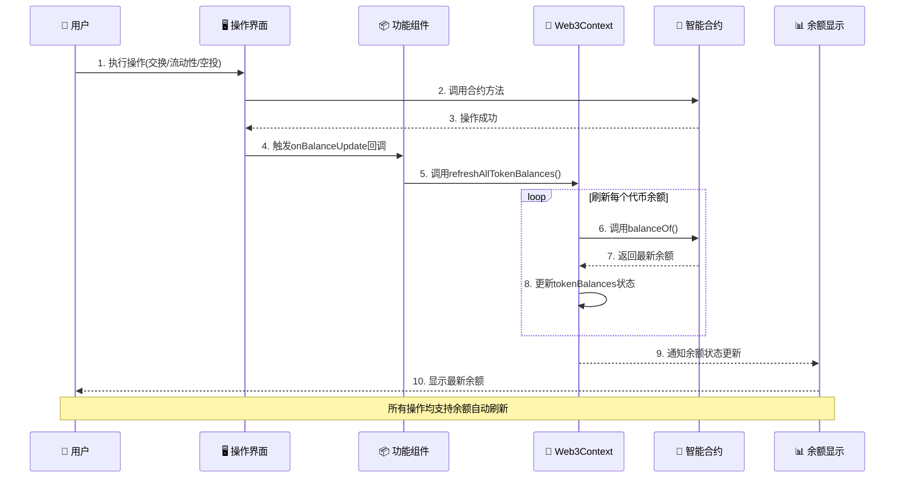

## 功能覆盖对比

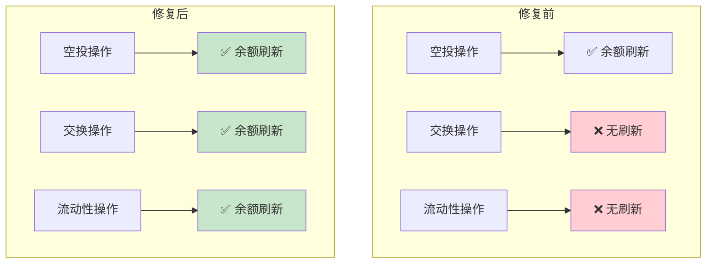

## 技术实现细节

### 回调机制统一

所有主要操作组件现在都支持相同的回调接口：

- `AirdropInterface` - 空投成功后刷新
- `SwapInterface` - 交换成功后刷新
- `LiquidityInterface` - 流动性操作成功后刷新

### 状态管理集中

通过 Web3Context 的`refreshAllTokenBalances`方法统一管理余额刷新：

- 自动刷新所有已导入的代币余额
- 更新全局 tokenBalances 状态
- 触发 UI 重新渲染显示最新数据

### 用户体验优化

- 操作成功即时反馈余额变化
- 无需用户手动刷新页面
- 保持界面响应性和数据一致性
- 统一的操作体验

# 余额显示不一致问题修复说明

## 问题描述

在前端界面中发现了余额显示不一致的问题：

- **左侧已导入代币列表**：显示实时的链上余额数据（通过 Web3Context.tokenBalances）
- **右侧操作界面（交换/流动性/空投）**：显示导入时记录的过时余额数据（通过 importedTokens.balance）

这导致用户看到的余额数据前后不一致，造成混淆。

## 数据源分析

### 修复前的数据流

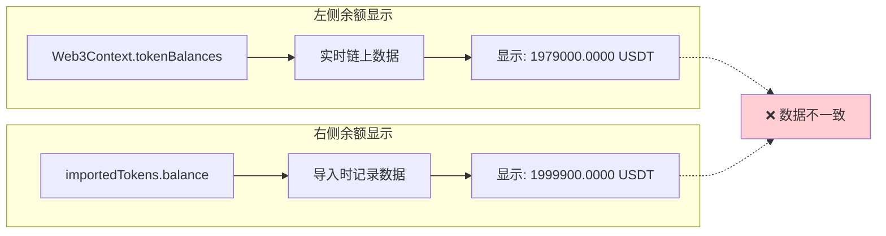

### 修复后的数据流

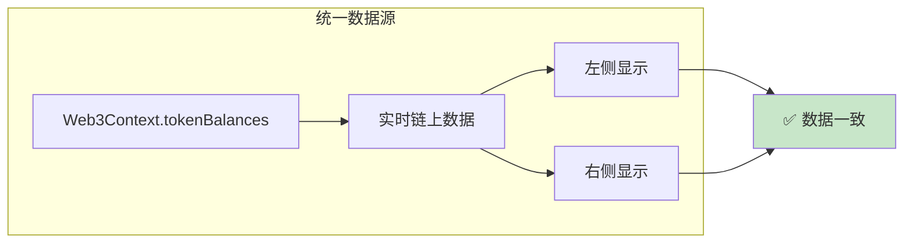

## 修复方案

### 1. SwapInterface 组件修复

```typescript
// 修复前
const { signer, routerContract, isConnected } = useWeb3();

// 余额显示
{
  fromToken ? parseFloat(fromToken.balance).toFixed(4) : "0.0000";
}

// 修复后
const { signer, routerContract, isConnected, tokenBalances } = useWeb3();

// 余额显示
{
  fromToken
    ? parseFloat(tokenBalances[fromToken.address] || "0").toFixed(4)
    : "0.0000";
}
```

### 2. LiquidityInterface 组件修复

```typescript
// 修复前
余额: {
  parseFloat(tokenA.balance).toFixed(4);
}
{
  tokenA.symbol;
}

// 修复后
余额: {
  parseFloat(tokenBalances[tokenA.address] || "0").toFixed(4);
}
{
  tokenA.symbol;
}
```

### 3. AirdropInterface 组件修复

```typescript
// 修复前
{
  parseFloat(selectedTokenInfo.balance).toFixed(4);
}
{
  selectedTokenInfo.symbol;
}

// 修复后
{
  parseFloat(tokenBalances[selectedTokenInfo.address] || "0").toFixed(4);
}
{
  selectedTokenInfo.symbol;
}
```

## 修复效果

- ✅ **数据源统一**：所有组件都使用 Web3Context.tokenBalances 作为唯一数据源
- ✅ **实时准确**：余额显示实时反映链上最新状态
- ✅ **用户体验**：左右余额数据一致，消除用户困惑
- ✅ **数据同步**：操作成功后余额立即更新，无需手动刷新

## 技术细节

### 数据获取机制

Web3Context 通过以下方式确保数据准确性：

1. **初始化时自动获取所有代币余额**
2. **操作成功后通过 refreshAllTokenBalances 刷新**
3. **账户变化时重新获取余额**
4. **网络变化时重新初始化**

### 容错处理

```typescript
// 使用安全的默认值防止显示错误
parseFloat(tokenBalances[tokenAddress] || "0").toFixed(4);
```

### 组件架构统一

现在所有主要操作组件都遵循统一的模式：

1. 从 Web3Context 获取 tokenBalances
2. 使用相同的格式化方法显示余额
3. 操作成功后调用 onBalanceUpdate 刷新

# 移除流动性功能问题修复说明

## 问题描述

用户在使用移除流动性功能时遇到错误，显示"移除失败 - 移除流动性失败"。经过分析发现是前端代码中 LP 代币授权机制和 ABI 定义不完整导致的。

## 问题分析

### 1. LP 代币授权机制问题

路由器合约的`removeLiquidity`函数需要：

1. 用户授权 LP 代币给路由器合约
2. 路由器调用`transferFrom`将 LP 代币转移到交易对合约
3. 交易对合约执行`burn`操作返还底层代币

### 2. ABI 定义不完整

原始的 PAIR_ABI 缺少关键的授权函数：

- `approve(address spender, uint256 amount)`
- `allowance(address owner, address spender)`
- `transferFrom(address from, address to, uint256 amount)`

## 修复方案

### 1. 完善 PAIR_ABI 定义

```typescript
const PAIR_ABI = [
  "function balanceOf(address owner) view returns (uint256)",
  "function totalSupply() view returns (uint256)",
  "function getReserves() view returns (uint112 reserve0, uint112 reserve1, uint32 blockTimestampLast)",
  "function token0() view returns (address)",
  "function token1() view returns (address)",
  "function approve(address spender, uint256 amount) returns (bool)", // 新增
  "function allowance(address owner, address spender) view returns (uint256)", // 新增
  "function transferFrom(address from, address to, uint256 amount) returns (bool)", // 新增
];
```

### 2. 改进授权检查逻辑

```typescript
// 检查当前授权
const currentAllowance = await pairContract.allowance(
  signerAddress,
  routerAddress
);
console.log("当前LP代币授权:", ethers.formatUnits(currentAllowance, 18));

if (currentAllowance < removeAmount) {
  console.log("需要授权LP代币...");
  addNotification({
    type: "info",
    title: "授权确认",
    message: "需要授权LP代币，请确认交易",
  });

  const approveTx = await pairContract.approve(routerAddress, removeAmount);
  await approveTx.wait();
  console.log("LP代币授权成功");
}
```

### 3. 增强错误处理和调试

```typescript
try {
  console.log("🔄 开始移除流动性...");
  console.log("代币A:", tokenA.symbol, tokenA.address);
  console.log("代币B:", tokenB.symbol, tokenB.address);
  console.log("移除比例:", removePercentage + "%");

  // ... 详细的执行步骤和日志
} catch (error: any) {
  let errorMessage = "移除流动性失败";
  if (error.reason) {
    errorMessage = error.reason;
  } else if (error.message) {
    if (error.message.includes("user rejected")) {
      errorMessage = "用户取消了交易";
    } else if (error.message.includes("insufficient allowance")) {
      errorMessage = "授权不足，请重新授权";
    } else if (error.message.includes("insufficient balance")) {
      errorMessage = "LP代币余额不足";
    } else {
      errorMessage = `交易失败: ${error.message}`;
    }
  }

  addNotification({
    type: "error",
    title: "移除失败",
    message: errorMessage,
  });
}
```

## 修复效果

- ✅ LP 代币授权机制正确实现
- ✅ 详细的错误信息帮助用户识别问题
- ✅ 完整的调试日志便于开发调试
- ✅ 符合 UniswapV2 标准的移除流动性流程

## 移除流动性完整流程图

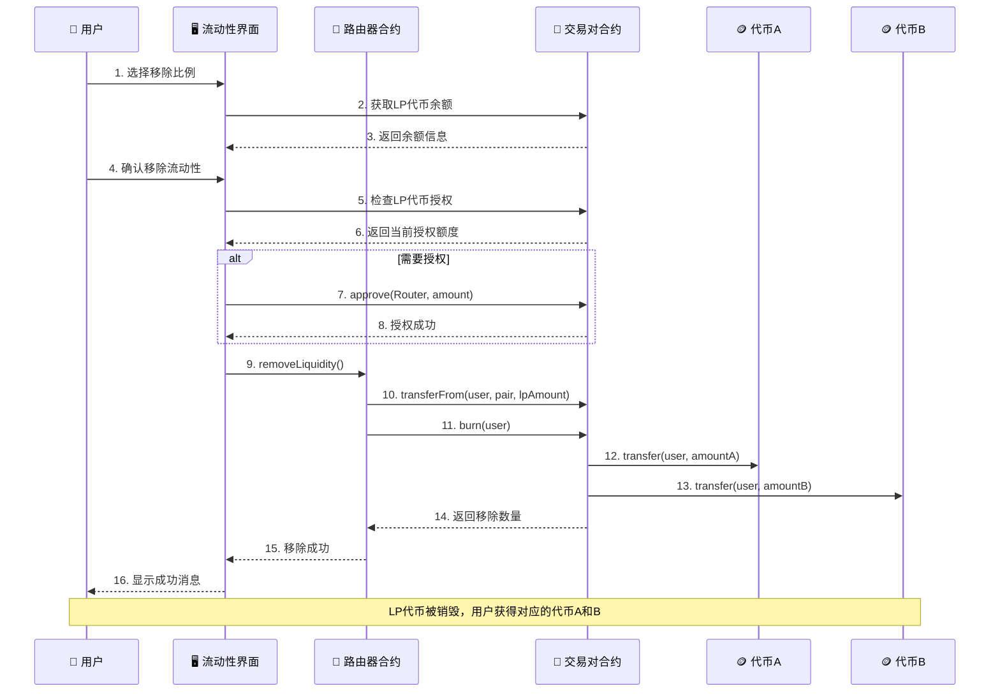

## 技术要点

### LP 代币授权机制

LP 代币是 ERC20 代币，需要遵循标准的授权流程：

1. 用户调用`approve`授权路由器使用 LP 代币
2. 路由器调用`transferFrom`转移 LP 代币到交易对
3. 交易对销毁 LP 代币并返还底层资产

### 代币顺序处理

```typescript
// 确定代币顺序并计算最小数量
let amountAMin, amountBMin;
if (token0.toLowerCase() === tokenA.address.toLowerCase()) {
  // tokenA 是 token0
  amountAMin =
    (reserves[0] * removeAmount * BigInt(95)) / (totalSupply * BigInt(100));
  amountBMin =
    (reserves[1] * removeAmount * BigInt(95)) / (totalSupply * BigInt(100));
} else {
  // tokenA 是 token1
  amountAMin =
    (reserves[1] * removeAmount * BigInt(95)) / (totalSupply * BigInt(100));
  amountBMin =
    (reserves[0] * removeAmount * BigInt(95)) / (totalSupply * BigInt(100));
}
```

### 滑点保护

使用 5%滑点保护，确保用户获得最小预期数量的代币：

```typescript
const amountAMin = (expectedAmountA * BigInt(95)) / BigInt(100);
const amountBMin = (expectedAmountB * BigInt(95)) / BigInt(100);
```

# 资金池总览功能新增说明

## 功能描述

新增了**资金池总览**标签页，用户可以查看所有已创建的流动性交易对信息，包括：

- 查看所有活跃的交易对
- 显示每个池的储备量信息
- 查看交换比例和总流动性
- 显示用户在每个池中的 LP 代币持有量
- 计算用户在池中的份额百分比
- 预估可提取的代币价值

## 技术实现

### 1. 新增 PoolsInterface 组件

```typescript
interface PoolInfo {
  token0: TokenInfo;
  token1: TokenInfo;
  pairAddress: string;
  reserve0: string;
  reserve1: string;
  totalSupply: string;
  userLPBalance: string;
  userShare: string; // 用户在池中的份额百分比
}
```

### 2. 自动发现交易对

通过 Factory 合约的`getPair`方法检查所有可能的代币对组合：

```typescript
// 生成所有可能的代币对组合
for (let i = 0; i < importedTokens.length; i++) {
  for (let j = i + 1; j < importedTokens.length; j++) {
    const tokenA = importedTokens[i];
    const tokenB = importedTokens[j];

    const pairAddress = await factoryContract.getPair(
      tokenA.address,
      tokenB.address
    );

    if (pairAddress !== ethers.ZeroAddress) {
      // 发现活跃交易对，获取详细信息
    }
  }
}
```

### 3. 获取详细池信息

对每个发现的交易对，获取：

- 储备量信息（`getReserves()`）
- LP 代币总供应量（`totalSupply()`）
- 用户 LP 代币余额（`balanceOf()`）
- 代币排序（`token0()`, `token1()`）

### 4. 计算用户份额

```typescript
// 计算用户在池中的份额百分比
const userShare =
  totalSupply > 0
    ? ((userLPBalance * BigInt(10000)) / totalSupply).toString()
    : "0";

// 转换为百分比
const sharePercentage = (parseInt(userShare) / 100).toFixed(2);
```

## 用户界面功能

### 主要显示信息

1. **交易对概览**

   - 代币对名称（如 USDT-ETH）
   - 交易对合约地址
   - 交易对编号

2. **流动性信息**

   - 两种代币的储备量
   - 当前交换比例
   - LP 代币总供应量
   - 总价值锁定（TVL）

3. **用户持仓信息**
   - 用户的 LP 代币数量
   - 在池中的份额百分比
   - 可提取的代币价值估算

### 交互功能

- **实时刷新**：手动刷新按钮更新所有池信息
- **自动加载**：连接钱包或代币变化时自动重新加载
- **状态指示**：显示检查进度和发现的交易对数量

## 用户体验优化

### 空状态处理

- 未连接钱包：引导用户连接钱包
- 代币不足：提示需要至少 2 个代币
- 无交易对：提示用户先创建流动性

### 数据展示

- 使用卡片布局清晰展示每个池
- 数字格式化显示（千分位分隔符）
- 颜色区分不同状态（有持仓/无持仓）
- 响应式设计适配不同屏幕

### 统计信息

页面底部显示汇总统计：

- 总交易对数量
- 用户持仓池数量
- 总 LP 代币数量
- 数据来源说明

## 资金池功能流程图

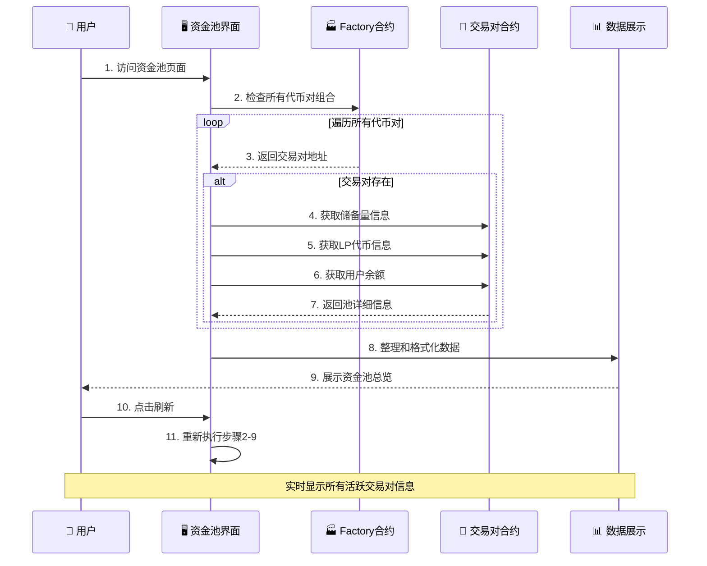

## 数据流架构

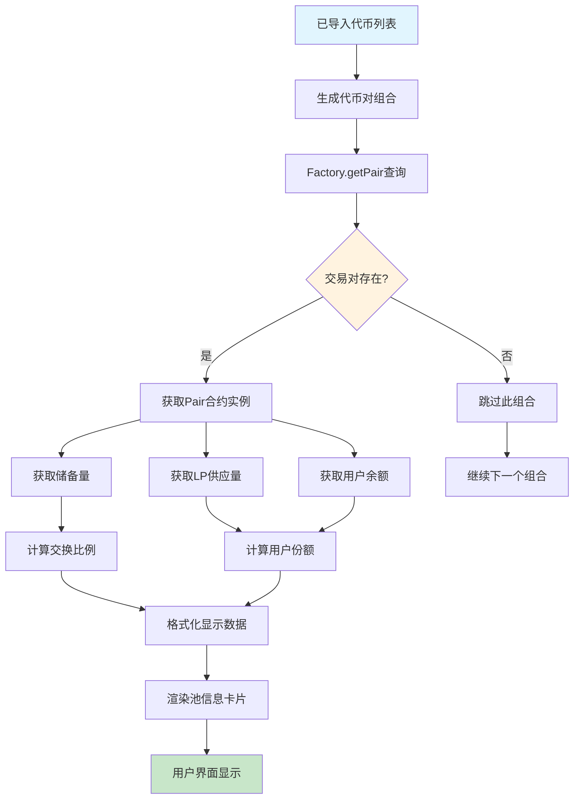

## 技术优势

1. **自动发现**：无需手动配置，自动发现所有可能的交易对
2. **实时数据**：直接从区块链获取最新信息
3. **用户友好**：清晰的界面布局和状态提示
4. **性能优化**：批量查询减少网络请求
5. **错误处理**：完善的异常处理和用户提示

## 扩展可能

未来可以基于此功能扩展：

- 添加 APY 计算和显示
- 加入 24 小时交易量统计
- 支持价格图表显示
- 添加池的历史数据分析
- 集成价格预警功能

这个资金池功能为用户提供了完整的流动性管理视图，是 DeFi 应用的重要组成部分。
